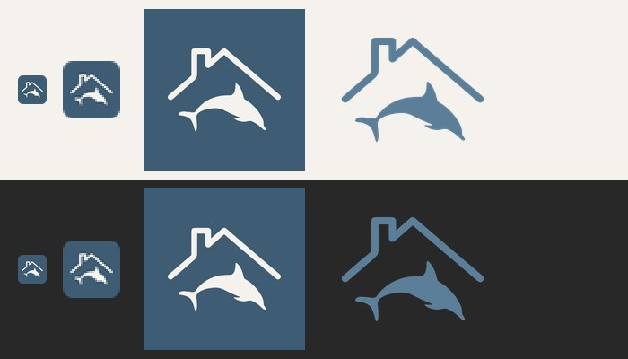
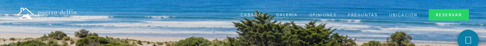
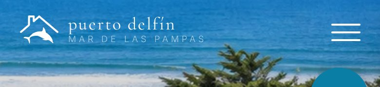
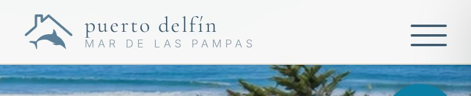
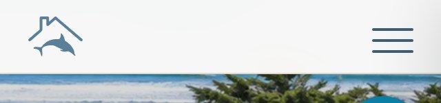
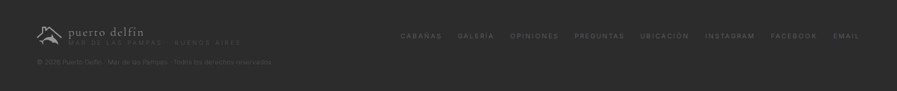
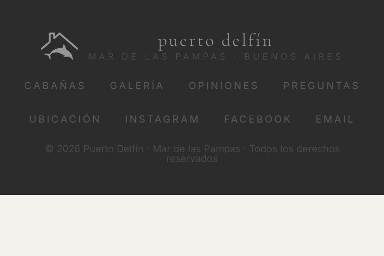

# Logo Puerto Delfín — Fase B (implementado)

Fecha: 2026-09-30 · Estado: **commiteado y pusheado a main**

## Qué se hizo

| # | Decisión | Resultado |
|---|---|---|
| 1 | Logo en el nav y el footer | Símbolo con CSS `mask` y `currentColor` + texto "puerto delfín" en Cormorant (texto real, no imagen). Nav: blanco sobre el hero y `--az` #5B7E99 sobre crema. Footer: hereda el blanco al 50 % de `.foot-brand`. |
| 2 | Favicon crema sobre `--az2` | `favicon-32.png` (32×32, cuadrado `#3E5C73` con esquinas redondeadas, símbolo `#F5F2EE`) y `apple-touch-icon.png` (180×180, cuadrado sin redondear y opaco, porque iOS redondea solo). `favicon.svg` se reemplazó por el mismo dibujo; antes era otro (gota + ola). |
| 2b | Rutas relativas | `/favicon.svg` → `favicon.svg`. Además `apple-touch-icon` y `manifest` pasan a ruta relativa, y en `site.webmanifest` se cambiaron `start_url` (`/` → `./`) y los íconos a rutas relativas. |
| 3 | Limpiar la metadata C2PA | `assets/logo.svg`: 15.577 → **6.773 B**. Saqué la metadata C2PA, compacté el path y recorté el viewBox al contenido (`0 0 1176 896` → `60 60 1056 776`, sin margen vacío). El aria-label pasó a "Puerto Delfín" con tilde. El original en `sistema-de-reservas` no se tocó. |
| 4 | `logo` en el JSON-LD | `"logo": "https://mdqclio.github.io/puertodelfin/assets/logo-512.png"`, un PNG de 512×512 con el símbolo #5B7E99 sobre fondo transparente. El JSON-LD valida (`json.loads` OK). Sin `aggregateRating`. |
| 5 | Botón flotante azul | No se tocó. |

**Ojo, punto 3:** pediste ~4 KB y quedó en **6,8 KB**. Bajar más implicaría simplificar
el trazo, o sea perder calidad, y no lo hice. GitHub Pages lo sirve con gzip (~3 KB).

Paleta y tipografía sin cambios: solo se usan las variables `--az`, `--az2` y `--b` que ya existían.

**Tamaños:** en el nav, desktop 48×35 px y móvil (≤900 px) 40×29 px. En el footer, 38×28 px.
Por debajo de 340 px el nav muestra **solo el símbolo**.

## Archivos

- Nuevos: `favicon-32.png` (1,7 KB), `apple-touch-icon.png` (8,7 KB), `assets/logo-512.png` (17 KB)
- Modificados: `assets/logo.svg`, `favicon.svg`, `index.html`, `site.webmanifest`

## Diff (`index.html` + `site.webmanifest`, revisado antes del commit)

```diff
-<link rel="icon" href="/favicon.svg" type="image/svg+xml">
-<link rel="apple-touch-icon" href="/favicon.svg">
-<link rel="manifest" href="/site.webmanifest">
+<link rel="icon" href="favicon.svg" type="image/svg+xml">
+<link rel="icon" href="favicon-32.png" type="image/png" sizes="32x32">
+<link rel="apple-touch-icon" href="apple-touch-icon.png" sizes="180x180">
+<link rel="manifest" href="site.webmanifest">

   "telephone": "+5492235365385",
+  "logo": "https://mdqclio.github.io/puertodelfin/assets/logo-512.png",

-.nav-brand { font-family: 'Cormorant Garamond', serif; ...
+.nav-brand { display: flex; align-items: center; gap: 10px; font-family: 'Cormorant Garamond', serif; ...
+.brand-logo { flex-shrink: 0; background-color: currentColor; -webkit-mask: url(assets/logo.svg) center/contain no-repeat; mask: url(assets/logo.svg) center/contain no-repeat; }
+.nav-brand .brand-logo { width: 48px; height: 35px; }
+#nav.solid .brand-logo { color: var(--az); }

-.foot-brand { font-family: 'Cormorant Garamond', serif; ...
+.foot-brand { display: flex; align-items: center; gap: 10px; font-family: 'Cormorant Garamond', serif; ...
+.foot-brand .brand-logo { width: 38px; height: 28px; }

+@media(max-width:340px){ .nav-brand .nav-txt{display:none;} }
 @media(max-width:900px){
+  .nav-brand .brand-logo{width:40px;height:29px;}

-  <a href="#inicio" class="nav-brand">puerto delfín<small>mar de las pampas</small></a>
+  <a href="#inicio" class="nav-brand"><span class="brand-logo" aria-hidden="true"></span><span class="nav-txt">puerto delfín<small>mar de las pampas</small></span></a>

-  <div class="foot-brand">puerto delfín<small>mar de las pampas · buenos aires</small></div>
+  <div class="foot-brand"><span class="brand-logo" aria-hidden="true"></span><span>puerto delfín<small>mar de las pampas · buenos aires</small></span></div>

 site.webmanifest
-  "start_url": "/",
+  "start_url": "./",
-    { "src": "/favicon.svg", "sizes": "any", "type": "image/svg+xml" }
+    favicon.svg (any) · apple-touch-icon.png (180x180) · assets/logo-512.png (512x512)
```

## Verificación headless (Chromium, antes del commit)

Para replicar GitHub Pages, serví el repo bajo **`/puertodelfin/`** (igual que
`mdqclio.github.io/puertodelfin/`) y desde la página hice `fetch` de cada `<link>`:

```
icon             /puertodelfin/favicon.svg          -> 200 image/svg+xml
icon             /puertodelfin/favicon-32.png       -> 200 image/png
apple-touch-icon /puertodelfin/apple-touch-icon.png -> 200 image/png
manifest         /puertodelfin/site.webmanifest     -> 200 application/manifest+json
manifest icons   favicon.svg / apple-touch-icon.png / assets/logo-512.png -> 200
mask             /puertodelfin/assets/logo.svg (resuelve bien)
```

Las rutas relativas resuelven dentro de `/puertodelfin/`. Antes, `/favicon.svg` se iba a la raíz del dominio.

### Íconos (arriba sobre fondo claro, abajo sobre oscuro)

De izquierda a derecha: favicon 32 px, el mismo ampliado 2×, apple-touch 180 y logo-512.



### Desktop 1366: nav crema


### Desktop 1366: nav sobre el hero



### Móvil 390 (2×): sobre el hero / crema




### Móvil 320 (2×): solo el símbolo



### Footer, desktop y móvil




Layout sin roturas: el nav mantiene su altura y la hamburguesa queda en su lugar.
En móvil el footer queda centrado.

## Pendiente / notas

- Botón flotante `--pd-accent #0a7ea4`: sigue fuera de la marca, queda para otra vez.
- Los navegadores cachean mucho el favicon: puede tardar en verse el nuevo en pestañas ya abiertas.
