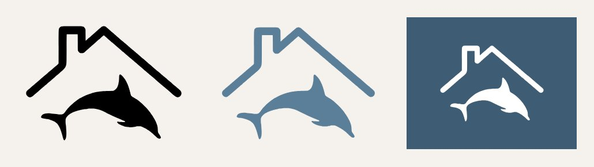
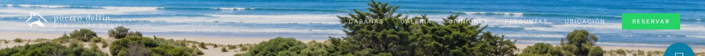
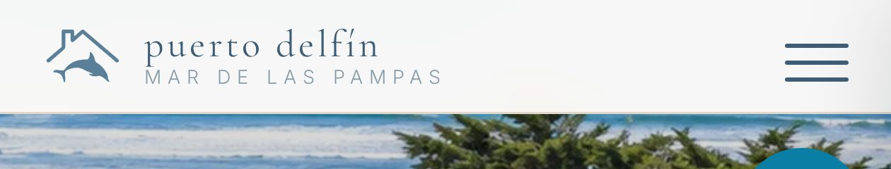
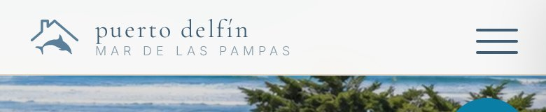
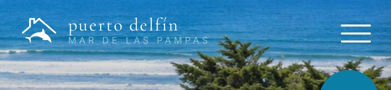

# Logo Puerto Delfín — Fase A (propuesta, sin cablear)

Fecha: 2026-09-30 · Estado: **frenado, esperando OK para Fase B**

## 1. Origen y copia

- Fuente: `~/dev/sistema-de-reservas/docs/logo-puerto-delfin.svg` — **existe** (repo
  local al día con origin/main; commit de origen `aecefc7 chore: logo de Puerto Delfín`).
  No se bajó nada de internet.
- Copiado a `assets/logo.svg` (byte a byte, 15.577 B). Se commitea en esta fase solo
  como archivo; **no está referenciado** desde `index.html`.

## 2. Qué tiene el SVG

| Dato | Valor |
|---|---|
| viewBox | `0 0 1176 896` (sin width/height → escala libre) |
| Proporción | 1,31 : 1 (apaisado) |
| Contenido | 2 `<path>` (techo con chimenea + delfín). **Solo símbolo, sin texto.** |
| Color | `fill="currentColor"` — **no trae #5B7E99 fijo** |
| Peso | 15,5 KB, de los cuales ~11 KB son metadata C2PA embebida |

**Color:** al ser `currentColor`, toma el color del texto donde se use. Es bueno
(un solo archivo sirve para azul sobre crema y blanco sobre hero), pero ojo:
usado como `` se ve **negro** (en `` no hereda color). Por eso la
propuesta usa CSS `mask` pintada con `currentColor` (o SVG inline). Con
`color: #5B7E99` da exactamente el azul pizarra de la marca (`--az`).

Captura (izq: `` crudo → negro; centro: mask con `#5B7E99` sobre crema;
der: blanco sobre `--az2`):



## 3. Propuesta de integración en el nav

Contexto del nav actual: es **transparente sobre el hero** (texto blanco) y pasa a
**crema sólido** (`rgba(253,251,248,.97)`) al scrollear (`#nav.solid`, texto `--az2`).
El símbolo tiene que funcionar en los dos estados.

Markup propuesto (el texto sigue siendo texto en Cormorant, no imagen):

```html
<a href="#inicio" class="nav-brand">
  <span class="nav-logo" aria-hidden="true"></span>
  <span class="nav-txt">puerto delfín<small>mar de las pampas</small></span>
</a>
```

```css
.nav-brand { display:flex; align-items:center; gap:10px; }
.nav-logo { width:46px; height:35px; flex-shrink:0; background-color:currentColor;
  -webkit-mask:url(assets/logo.svg) center/contain no-repeat;
          mask:url(assets/logo.svg) center/contain no-repeat; }
#nav.solid .nav-logo { color: var(--az); }          /* azul pizarra #5B7E99 */
@media(max-width:900px){ .nav-logo{ width:38px; height:29px; } }
@media(max-width:340px){ .nav-brand .nav-txt{ display:none; } }  /* solo símbolo */
```

**Tamaños propuestos**
- Desktop: **35 px de alto** (46 px ancho) — alineado a la altura de "puerto delfín" + subtítulo.
  Probé 30 px primero: el trazo del techo quedaba demasiado fino.
- Móvil (≤900 px): **29 px de alto**.
- **Solo símbolo** por debajo de 340 px. En 390 px (iPhone) el texto entra cómodo: en
  móvil el nav es solo marca + hamburguesa, así que no hace falta sacarlo.

**Colores:** sobre el hero → blanco (como el texto actual). Nav crema → símbolo
`--az` #5B7E99 y texto sin cambios (`--az2`). No se toca la paleta ni la tipografía.

### Capturas (mockup headless, no está en el sitio)

Desktop, nav crema (scrolleado):


Desktop, sobre el hero:



Móvil 390 px, nav crema (zoom 3x):



Móvil 390 px, crema / hero:




Lectura: sobre crema, el azul pizarra combina bien con el texto en `--az2`. El delfín
se lee a 29 px. Sobre el hero en blanco se lee, pero queda algo liviano con fondos
claros (arena/espuma), igual que el texto actual.

## 4. Notas para la Fase B (decidir con el OK)

1. **Favicon actual roto en GitHub Pages:** `index.html` usa `href="/favicon.svg"`
   (ruta absoluta desde la raíz). En `mdqclio.github.io/puertodelfin/` eso apunta a
   `mdqclio.github.io/favicon.svg`, no al del repo. En B se pasa a ruta relativa
   (`favicon-32.png`, `apple-touch-icon.png`). Además el favicon actual es otro
   dibujo (gota + ola sobre cuadrado azul); se reemplaza por el símbolo.
2. **Favicon 32×32 con fondo transparente:** el techo es de trazo fino; a 32 px se
   va a ver chico. Propongo recortar el viewBox al contenido y usar
   todo el ancho. Si en pestañas oscuras se pierde, alternativa: símbolo crema sobre
   cuadrado azul (como el favicon actual). Por defecto hago transparente como pediste.
3. **JSON-LD `logo`:** el resto de imágenes del JSON-LD ya usan
   `https://mdqclio.github.io/puertodelfin/...`, así que `logo` va igual
   (`.../assets/logo-512.png`, 512×512, símbolo centrado, fondo transparente).
   El `url`/canonical siguen en `www.puertodelfin.com`, sin cambios.
4. **Metadata C2PA:** propongo limpiarla en una copia optimizada (~4 KB) para el
   sitio; el original queda en `sistema-de-reservas`.
5. Footer: mismo símbolo, blanco con la misma opacidad que `.foot-brand` (0,5), ~28 px.
6. Fuera de alcance, visto en las capturas: el botón azul flotante abajo a la derecha
   (`--pd-accent #0a7ea4`) usa un azul que no es de la marca. No lo toco.

**No se cableó nada en `index.html`.** Espero OK para Fase B.
