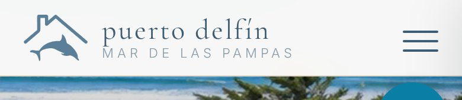
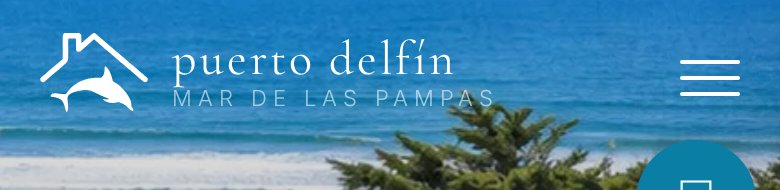

# Logo del nav más grande

Fecha: 2026-10-01 · Estado: **commiteado y pusheado a main**

## Cambios (solo el nav: footer, favicon y colores quedan igual)

| | Antes | Ahora |
|---|---|---|
| Símbolo desktop (alto × ancho) | 35 × 48 px | **48 × 65 px** |
| Símbolo móvil ≤900 px | 29 × 40 px | **40 × 54 px** |
| "puerto delfín" (Cormorant) | 18 px | **24 px** (18 × 48/35 ≈ 24,7) |
| "MAR DE LAS PAMPAS" (Inter) | 9 px | **11 px** |
| Espacio entre símbolo y texto | 10 px | 12 px |

El texto también se agranda en móvil, porque entra (ver medidas). En móvil se
mantiene **símbolo + texto**. Solo queda el símbolo por debajo de 340 px, igual que antes.

**Desktop angosto (901–1000 px):** para esa franja agregué una excepción que deja la
marca en el **tamaño anterior** (35 px / 18 px). Motivo: ya antes del cambio, a 901 px
la marca terminaba justo donde empieza "Cabañas" (0 px de aire). Con el tamaño grande
los links se superponían entre ~900 y ~980 px. De 1001 px para arriba va el tamaño grande.

## Diff (revisado antes del commit)

```diff
-.nav-brand { ... gap: 10px; ... font-size: 18px; ... }
-.nav-brand small { ... font-size: 9px; ... }
+.nav-brand { ... gap: 12px; ... font-size: 24px; ... }
+.nav-brand small { ... font-size: 11px; ... }
-.nav-brand .brand-logo { width: 48px; height: 35px; }
+.nav-brand .brand-logo { width: 65px; height: 48px; }

 @media(max-width:1100px){ .nav-links{gap:22px;} }
+/* desktop angosto: marca al tamaño compacto para no pisar los links */
+@media(min-width:901px) and (max-width:1000px){ .nav-brand{font-size:18px;gap:10px;} .nav-brand small{font-size:9px;} .nav-brand .brand-logo{width:48px;height:35px;} }

 @media(max-width:900px){
-  .nav-brand .brand-logo{width:40px;height:29px;}
+  .nav-brand .brand-logo{width:54px;height:40px;}
```

## Verificación: los links no se movieron

Medí con Chromium headless las posiciones reales (`getBoundingClientRect`, en px)
antes y después del cambio, con el nav sobre el hero y con el nav crema.

| Ancho | Borde derecho de la marca (antes → ahora) | Comienzo de "Cabañas" (antes → ahora) | Aire libre ahora | Alto del nav, crema (antes → ahora) |
|---|---|---|---|---|
| 1440 | 250 → 287 | **735 → 735** | 448 px | 64 → 77 |
| 1100 | 250 → 287 | **445 → 445** | 158 px | 64 → 77 |
| 960 | 250 → 250 (compacto) | **305 → 305** | 55 px | 64 → 64 |
| 901 | 246 → 246 (compacto) | **246 → 246** | 0 px (igual que antes) | 67 → 67 |

- Los links no cambiaron de posición horizontal en ningún ancho. Todos siguen en una
  sola fila y no aparece scroll horizontal.
- El nav crema pasa a 77 px de alto. El `scroll-margin-top: 88px` de las secciones
  sigue cubriéndolo, así que los anclas (#cabanas, etc.) no quedan tapadas.

**Móvil:**

| Ancho | Borde derecho del texto | Comienzo de la hamburguesa | Aire | Alto del nav, crema |
|---|---|---|---|---|
| 390 | 248 | 325 | **77 px** | 54 → 65 |
| 360 | 248 | 295 | 47 px | 54 → 65 |
| 340 | solo símbolo | 275 | — | 54 → 65 |

En 390 px el header queda alineado: el símbolo, el texto y la hamburguesa quedan
centrados en vertical y nada se pisa.

## Capturas (headless, servidas por HTTP como en GitHub Pages)

Desktop 1440, nav crema:


Desktop 1440, sobre el hero:


Móvil 390 (2×), nav crema:



Móvil 390 (2×), sobre el hero:



Desktop angosto 960, tamaño compacto (no pisa los links):


Nota técnica: abierto como archivo local (`file://`) el símbolo no se ve, porque el
navegador carga las máscaras CSS con CORS. En el sitio real (mismo origen) carga
bien; las capturas de arriba están hechas por HTTP.
